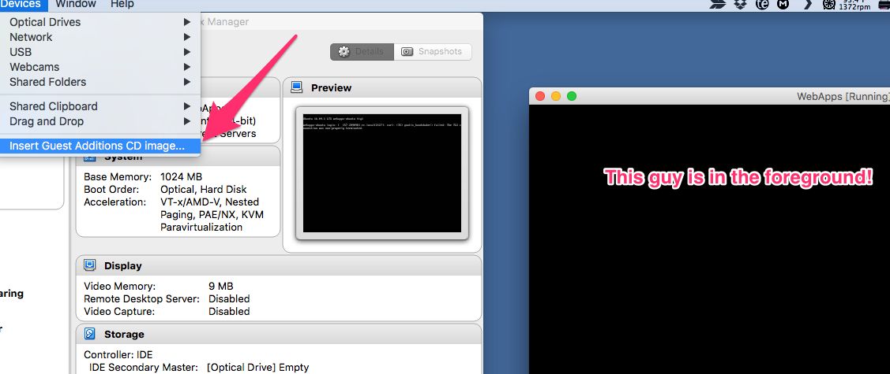

===========================
VirtualBox Guest Additions
===========================

VirtualBox Guest Additions is, more or less, VirtualBox's way of making it easier for your host machine to speak to your guest machine, and do all sorts of extra things. Examples:

1. Easier File Sharing

  - Instead of dealing with mounting drives in an ``/etc/fstab`` file, VirtualBox has a means of setting up a simple Directory sharing scheme
  - You pick certain directories on your host machine to be shared directly into the ``/media/<folder name you set>`` directory!

2. If you're running a GUI:

  1. Shared Clipboard
  2. Drag'n'Drop files back and forth
  3. Mouse Pointer Integration - You don't have to "release" the mouse from the guest screen
  4. Better Video Support
  5. Seamless Windows - This opens individual windows in the guest as if they were individual windows on the host directly, eliminating the boundary between the host and guest OS.

First, we will show how to begin the install on our Host machine, then directly into our guest machine.

------------
Host Machine
------------

So, first we need to mount the Guest Additions CD Image, which you can find under the "Devices" menu in the Virtual Machines Menu Bar. (Make sure the Guest Machine window is in focus to show that machines menu bar.)

Then, depending on what OS your guest is running depends on what the next steps are. We will be concentrating on Ubuntu Server, Headless installs. Seeing as that needs a big more work on our part than any GUI-based system.

-------------------------------------
Ubuntu Server Guest Machine
-------------------------------------

Pre-Requirements
================

First, lets install the pre-requirements.

.. code-block:: bash

  sudo apt-get install dkms make gcc -y

Mount the CDROM
===============

Then, to install the Guest Additions onto your Headless Ubuntu Server addition, you first have to mount the cd onto your directories so you can access whats inside.

.. code-block:: bash

  sudo mount /dev/cdrom /media/cdrom

Mounting Info
---------------

The ``/dev/cdrom`` is where your cdrom "hardware" is located in order for the software to access it. As in this would be the actual, physical cdrom drive if your server was physical.

Then, the ``/media/cdrom`` is where you're mounting your cdrom so you can access the files.

Run the Installer
===================

It'll alert you to the fact that the mounted filesystem is ``read only``. You're good to ignore that since we wont be making edits to the files. Then, cd into the mounted location, and run the installer.

.. code-block:: bash

  cd /media/cdrom
  sudo sh ./VBoxLinuxAdditions.run

That will take a hot second, at least, to run the installer. But, once its finished - and there were no error messages - go ahead and restart your machine.

.. note::

  Make sure you have setup all of the configuration options in the machine settings, as in the folders you want to have shared from host to guest.

``usermod``
=============

Now, you'll need to add the group name ``vboxsf`` to all of the different system and user accounts.

.. note::

  ``vboxsf`` is VirtualBox's group-ownership-way of mounting these directories.

Services Info
=============

If you have any services with custom user/group names, like ``transmission-daemon``, stop those services before the next step please.

.. code-block:: bash

  sudo usermod -aG vboxsf $USER
  sudo usermod -aG vboxsf debian-transmission
  sudo usermod -aG vboxsf root

Then, it doesn't hurt to restart your machine. Just to make sure all accounts have signed out and back in again, so they can access any `vboxsf` group items.
