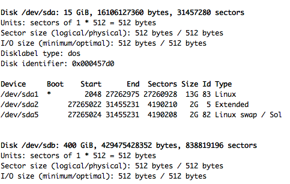

.. _mounting-drive:

====================================
Mounting Unformatted Drive in Ubuntu
====================================

Here, we will be mounting a new drive in Ubuntu. The beginning items will be for adding a partition, and then formatting it to an EXT4 filesystem.

Personally, the reason I needed this was that I had created a 2nd VirtualDisk in my VirtualBox Host, and needed to figure out how to format it and then mount it to my Ubuntu 16.04 Guest.

------------------------
Install/Create the Drive
------------------------

I'm not going to really detail this part, because if you purchased a new, internal drive - or even an external, USB drive - it either came with directions or you know how to install that.

As for the VirtualDisk for your VM of choice, that usually is fairly easy. At least with VirtualBox it is.

-----------------
Finding the Drive
-----------------

So, obviously, we need to find the system-assigned ID for the drive, as this is the info we use for formatting, mounting, etc.

So, we will be using ``fdisk`` for these next few steps:

.. code-block:: bash

  sudo fdisk -l

.. note::

  In my Ubuntu instance inside of VirtualBox, not only did it show my Drives, but ``/dev/ram`` drives as well. I'm assuming this is just one form of memory and disk I/O management VirtualBox uses.

So, my 2nd hard drive is labeled as ``/dev/sdb``, and because I had just created the virtual drive on my host machine, there are no partitions.

-----------------
Create Partitions
-----------------

Now we want to create the partitions for the drive. For me, since I only wanted one large partition, this is easy with fdisk. If you're wanting/needing a more complicated setup, it might be best to lookup ``parted`` and ``gparted`` (graphical version of parted) for better partitioning.

So, now, we want to run

.. code-block:: bash

  sudo fdisk /dev/sdb

Or, if you're drive's name is different, replace the /dev/sdb with whatever yours is.

You now will be dropped into the ``fdisk`` shell prompt. To start the creation of a new partition, press ``n`` and enter to start.

Next, since we're doing one, whole-drive partition, select ``p`` for ``primary partition``. Then, you can just hit ``enter`` through ``Partition Number``, ``First sector`` and ``Last sector`` as those have defaults pre-filled for you, if you would rather use those.

This creates, in memory - WITHOUT formally writing to the disk - a partition for the drive. You have to hit ``w`` in order to formally write the information onto the disk. But, before you do that, I suggest now using option ``p`` for ``print the partition table`` so you can confirm the information before fatally committing to it.

----------------
Write Partitions
----------------

Now, once you KNOW for SURE you're ready, use the ``w`` option to write to disk. And then, depending on your version of ``fdisk``, it'll either drop you back into the normal shell immeditely, or you'll have to ``q`` - for quit - to quit out of fdisk.

-----------
Partprobe
-----------

Next, you want to run ``partprobe`` in order to tell the kernel, without restarting your machine, about the changes made to that harddrive.

.. code-block:: bash

  sudo partprobe /dev/sdb

Or, whatever your devices name is.

-------
Format
-------

Now, we need to format our drive so the filesystem is readable/writable and what nots.

.. code-block:: bash

  sudo mkfs /dev/sdb1 -t ext4

So, that is ``mkfs`` or makefilesystem, then our drive with the partition number. The ``-t`` flag is for type of filesystem, and ``ext4`` for, well, ext4 filesystem.

If you are wanting/needing a different system, please consult those specific formatting directions.

-----------
Mount Point
-----------

Now, you need to create a directory that you want this disk mounted to, as that is how you are able to access this drive.

I personally tend to mount all my drives inside of ``/media``. No real reason for it. Just started that way and became habit. You can mount this drive anywhere you want. But, beside ``/media``, there is also the ``/mnt`` directory, which is much more of a literal "duh, stick it here" kind of naming that linux loves.

So, make the directory, adjust the ownership info, then mount the ext4 filesystem drive:

.. code-block:: bash

  sudo mkdir /media/<name of folder>
  sudo chmod -R 777 /media/<name of folder>
  sudo mount /dev/sdb1 /media/<name of folder> -t ext4

So, lets break that down:

1. ``chmod`` - changing the ownership levels to the mode ``0777`` which translates to: anyone can do anything with this.
2. ``mount`` - obviously the mount program

  1. The first option has to be the device with partition number you want to mount
  2. The second option being the directory to mount ONTO
  3. ``-t ext4`` being "type ext4"

-----------
After Mount
-----------

Now, if you didn't receive any error messages, you can basically, with 99% confidence, say its mounted. But, doesn't hurt to ``cd`` into it and create a blank file real quick to test the read/write.

.. code-block:: bash

  cd /media/<name of folder>
  touch ./test.txt
  ls -lah
  sudo rm ./test.txt

So, if those all worked, its mounted and you can read/write to it.

------------------
Permanent Mounting
------------------

The best way to be able to mount your drives using ``/etc/fdisk`` is by referencing the drive's UUID number. How do you check that?

.. code-block:: bash

  sudo blkid

it will give you a line for every drive and partition that it can find. You can use either the ``UUID`` or the ``PARTUUID`` in your ``fstab`` file.

.. code-block:: bash

  PARTUUID=86e32033-01  /boot           vfat    defaults          0       2
  PARTUUID=86e32033-02  /               ext4    defaults,noatime  0       1
