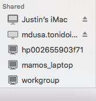
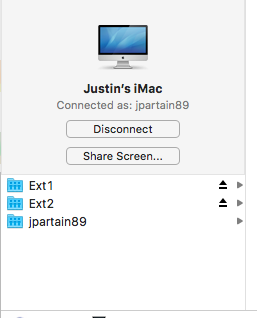

==============
Back To My Mac
==============

So, Apple provides a service they call "Back To My Mac" that helps to facilitate a super easy means of connecting to other Apple Machines that you have setup with your AppleID and sharing settings turned on.

Normally, the various features that Apple has given us tend to be, if anything, tedious at best and impossible at worst to setup, use and maintain on your own. And thats for those of us with a bend towards the technical idealism, not to mention those who could care less about the backend of how or why.

Finder Stuff
============

The first, big use for BTMM would be the ability to access, say, your hard drives that are connected to your iMac, while you aren't at home. If, of course, you have file sharing turned on.

If, at home or while on the road, there are other computers or printers on the same network and visible, you can see them in your Finder's Side Bar (if you have that turned on in Finder's Preferences menu) without having to do much of anything. This is the same spot that your other Apple Machines will appear as well.

There, under "Shared", you can see "Justin's iMac". In here, you have a few more options, specifically dependent upon the settings you have currently setup on your system. From Screen Sharing to accessing your shared files, as well as the specific means of logging in remotely.

These options are available, even when you are away from your home network when setup appropriately.

SSH
====

You are also able to use the back to my mac service to help facilitate ssh access to your machines as well, without knowing your public IP address or even forwarding any ports on your router.

One command you can use to get various bits of info is ``dns-sd -E``. This gives you a, admittedly weird, layout of your back to my mac address.

.. code-block:: bash

  Looking for recommended registration domains:
  DATE: ---Wed 24 Aug 2016---
  22:28:28.704  ...STARTING...
  Timestamp     Recommended Registration domain
  22:28:28.706  Added     (More)               local
  22:28:28.706  Added                          icloud.com
                                            - > btmm
                                            - - > members
                                            - - - > 1307196220

The best one liner command to get a nice looking format of the same address is:

.. code-block:: bash

  echo show Setup:/Network/BackToMyMac | scutil | sed -n 's/.* : *\(.*\).$/\1/p'

This gives you:

.. code-block:: bash

  1307196220.members.btmm.icloud.com

Which, that number, is honestly not a bad thing to show to the world, because you also need your specific machine name, username and password or SSH keys to really do anything.

So, a full example address is:

.. code-block:: bash

  ssh jpartain89@imac.1307196220.members.btmm.icloud.com

Setting Up BTMM
===============

So, how do you turn this stuff on?

In your System Preferences app - accessible either in your LaunchPad, hitting the Apple Icon > System Preferences or using SpotLight search - you open the Sharing Pane first. Here, you can see the various services available, what is activated or not, and those granular settings as well.

Inside of File Sharing, you are able to select the specific directories and files that you want to have broadcast as shareable. Here, when activated, it will broadcast over your local network only. But, it also requires a username and passworded account on your machine to use as the means to access those files. Under the Options button, if you utilize other machines than a mac in your house, and you expect those to need your shared files, turn on ``Share FIles and Folders using SMB``. You'll also need to read through the ``Windows File Sharing`` section and see if you need that.

Next, once that is finished, open the iCloud Preferences Pane, scroll to the bottom of all of the options, and you'll see the Back To My Mac option line. When activated, if any issues arise for proper operation that will be displayed here, as well as a simple how-to fix message.

Once those steps are finished, and you aren't at home and connected to the internet and the home machine is working, you'll see in your Finder the Machine and have the access that you setup!
