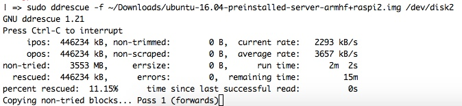
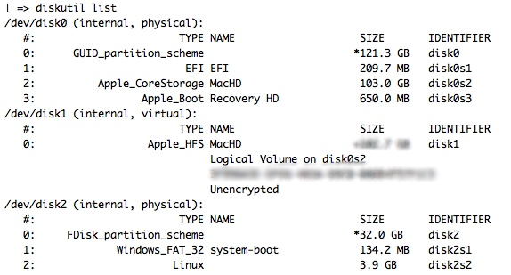

# Imaging SD Card for Raspberry Pi

This is my personal, favorite means of imaging an SD Card through the command line - which is the easiest, most foolproof means of doing so. Plus, its also learning, which is reason #1 for doing this....

I use the tool `ddrescue` rather than `dd` like most other sites say to. The reason?



A nice, command line output of its copying progress.... Not to mention ddrescue tends to be a more granular means of copying files over.

Plus, sans SD Card? Its a good backup tool to have for, well, backing up filesystems on a more granular, hardware-is-prone-to-fail type of level. Also allowing multiple passes over said data, so that if the sector pooped out the first time, maybe a 2nd or 3rd pass would, maybe not help but increase the odds of that one sector copying.

## Installing:

So, if you're using macOS? I would assume/hope you have [HomeBrew][a5d30315] installed. If so, do:

[a5d30315]: brew.sh "HomeBrew - The Missing Package Manager for OS X"

```bash
brew install ddrescue
```

On Linux, the specific, newer and updated tool is called [GDDRescue][39950b63], since its a part of the GNU Library of Tools.

  [39950b63]: https://www.gnu.org/software/ddrescue/ddrescue.html "GDDrescue"

So you would:

```bash
sudo apt-get install gddrescue
```
--or--
```bash
sudo yum install gddrescue
```

or whatever your flavor of linux installer is.

But, to move on...

## How to use?

First, do your OS of choices means of discovering the location of the SD card you want to image:

macOS/OS X?

```bash
diskutil list
```



Which gives you the list of all drives mounted or visible on OS X/macOS. Which, usually your SD Card is last.

Then:

```bash
diskutil umountDisk /dev/disk##
```

Replacing ## with the disk drive number you found from before.

```bash
sudo ddrescue -f ~/.img/location/to/copy/tosd /dev/disk##
```

So, a bit is going on here.

First, sudo, since we're imaging a file onto a drive.

Second, -f is for Force, telling ddrescue we REALLY want to image this file onto this drive.

Third, the first file location. This is the source file, or what you want the SD card to look like. Or in the case of backing up a drive, the first location.

Then, the /dev/disk##. Make sure to replace ## with the drive number, again. This is the final place you want the info copied to. If you were doing the backup, like above, you could specify a specific file location, name and format to output the info into. Which is beyond this documents scope. `man ddrescue`, or `ddrescue --help` can get you in the right direction.

Next, sit back and watch as you can watch the timer count down, the length of time passed count up, and plenty of other info while `dd` users have to sit and wait and HOPE it works!
