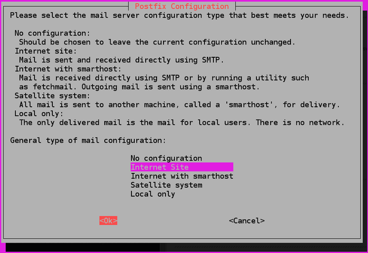
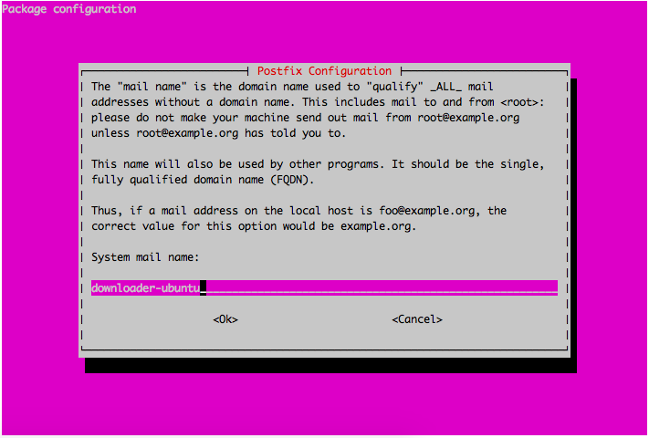

# Use Postfix as relay [^Sourcing]

So, postfix is a fairly simple mailserver software, that, to be honest, the reason I'm using it is because the most recent, up to date how-to's all use postfix. Which, I'm assuming that means its probably one of the easier mail systems to configure.

But, we will be using it to forward all of the system emails to our personal email address. I use gmail, so my examples will be more geared towards gmails smtp address and port.

## Install Postfix

```bash
sudo apt-get install postfix mailutils
```

Now, during this installation, the system will prompt you with `Configuration Option`. Since we will be using an outside service to send our mail - aka [smtp.gmail.com](smtp.gmail.com) - we will select `Internet Site`.

If we were to use postfix in other ways, we'd pick another option.



Then, it will continue on with `System Mail Name`, which, technically you would normally want a FQDN address listed here. But, using your systems basic hostname is also fine, especially if you have just a couple of machines.



## Configure Postfix

We will be setting the system to process emails only from "the server on which it is running," aka the `localhost` or `loopback interface`. That way, when postfix "receives" an email from the system - for say, root - it will use Postfix to forward the email off through our specified smtp server. Thus, using the loopback as the "catch-all" for the emails.

### Password File

First, we're going to make a seperate, locked down password file:

```bash
sudo nano /etc/postfix/sasl_passwd
```

And add the line:

```bash
[smtp.gmail.com]:587        username@gmail.com:password
```

Which, of course, if you use a different mail service, input their info and it should work just the same.

Now, lock that file down!

```bash
sudo chmod 600 /etc/postfix/sasl_passwd
sudo chown root:root /etc/postfix/sasl_passwd
```

### Main Configure File

Also, in the `main.cf` file, there are 6 specific parameters we will be using for the relay setup:

1. `relayhost` which specifies the mail relay host and port number. The host name will be enclosed in brackets to specify that no MX lookup is required.
2. `smtp_use_tls` which enables (or disables) transport layer security.
3. `smtp_sasl_auth_enable` which enables (or disables) SASL authentication.
4. `smtp_sasl_security_options` which in the following configuration will be set to empty, to ensure that no Gmail-incompatible security options are used.
5. `smtp_sasl_password_maps` which specifies the password file to use. This file will be compiled and hashed by postmap in a later step.
6. `smtp_tls_CAfile` which specifies the list of certificate authorities to use when verifying server identity.

```bash
sudo nano /etc/postfix/main.cf
```

`main.cf` is postfix's config file.

You will most likely have to add most of the above options, possibly deleting one or two in order to clump them all together in one, single block of text.

```bash
relayhost = [smtp.gmail.com]:587
smtp_use_tls = yes
smtp_sasl_auth_enable = yes
smtp_sasl_security_options =
smtp_sasl_password_maps = hash:/etc/postfix/sasl_passwd
smtp_tls_CAfile = /etc/ssl/certs/ca-certificates.crt
```

## Process Password File

Remember when you installed `mailutils`? That was for `postmap`, which compiles and hashes the contents of our `sasl_passwd` and creates a new file in the same spot, `sasl_passwd.db`.

## Restart Postfix

Restart postfix, enabling our various changes:

```bash
sudo systemctl restart postfix.service
```

## Test Send Emails

This is testing if the actual forwarding part works.

To send a test email over the command line:

```bash
echo "This is the body of the email" | mail -s "This is the subject line" user@example.com
```

Making sure to put your email address in place of `user@example.com`. You should receive the email within a few seconds.


[^Sourcing]: Copied very liberally from [HowToForge Postfix How-To](https://www.howtoforge.com/tutorial/configure-postfix-to-use-gmail-as-a-mail-relay/)
