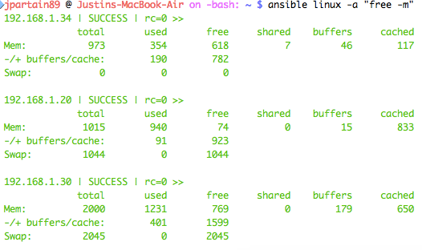
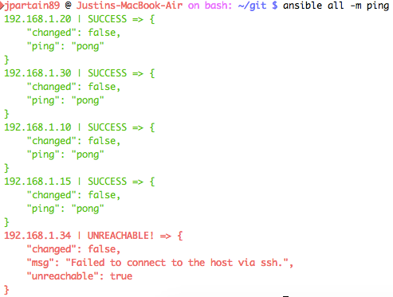

=================================
Ansible's ad-hoc Reference Guide
=================================

Yes, I know this is like, the first thing that ansible's `Documentation site <https://github.com/ansible/ansible/blob/devel/docsite/rst/intro_getting_started.rst#your-first-commands>`_ teaches you. But, again, it IS, like, the first thing this massive thing teaches you, and not in too much detail.

So, here's a repeat, refresher, with screenshots!!

.. code-block:: bash

  ansible ubuntu -a 'free -m'

This just runs ansible's `command` module. As in it doesn't support shell variables and things like piping. Thus, why the only flag given is the ``-a`` flag. If you wanted to change the module used, you'd include the ``-m`` flag before ``-a``, as the ``-a`` flag tells ansible the text within the \` \` is the actual text for the module requested.

Next, we change the module to ``ping``

.. code-block:: bash

  ansible all -m ping

This doesn't require the ``-a`` flag, unless there are other options you want to include with the ``ping`` module. Otherwise, this will run a simple ping on the hosts you requested.

