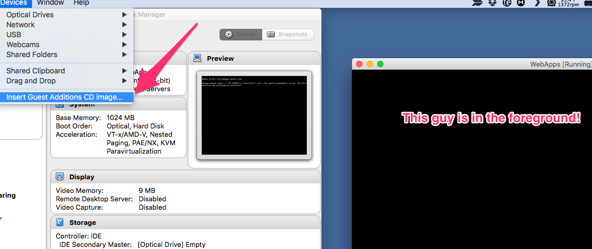

VirtualBox Guest Additions
===========================

VirtualBox Guest Additions is, more or less, VirtualBox's way of making it easier for your host machine to speak to your guest machine, and do all sorts of extra things. Examples:

1. Easier File Sharing
  - Instead of dealing with mounting drives in an ``/etc/fstab`` file, VirtualBox has a means of setting up a simple Directory sharing scheme
  - You pick certain directories on your host machine to be shared directly into the ``/media/<folder name you set>`` directory!

2. If you're running a GUI:
  1. Shared Clipboard
  2. Drag'n'Drop files back and forth
  3. Mouse Pointer Integration - You don't have to "release" the mouse from the guest screen
  4. Better Video Support
  5. Seamless Windows - This opens individual windows in the guest as if they were individual windows on the host directly, eliminating the boundary between the host and guest OS.

Installing
--------------

First, we will show how to begin the install on our Host machine, then directly into our guest machine.

Host Machine
__________________

So, first we need to mount the Guest Additions CD Image, which you can find under the "Devices" menu in the Virtual Machines Menu Bar. (Make sure the Guest Machine window is in focus to show that machines menu bar.).



Then, depending on what OS your guest is running depends on what the next steps are. We will be concentrating on Ubuntu Server, Headless installs. Seeing as that needs a big more work on our part than any GUI-based system.

Ubuntu Server Guest Machine
_____________________________________

```bash
sudo apt-get install dkms make gcc -y
```

You need to make sure that `dkms` is installed before any other VirtualBox-like software is installed.
> Now, its not 100% the end of the world if you went outta order. Its just easier this way.

Now, on the GUI interface of your VirtualBox running instance, hit `Devices` and you **_should_** see at the bottom of the menu, `Insert Guest Additions CD Image.`

Hit, that, then go back to your running VM.

```bash
sudo mount /dev/cdrom /media/cdrom
```

It'll alert you to the fact that the mounted filesystem is read only. You're good to ignore that, and cd into the mounted location, and run the installer.

```bash
cd /media/cdrom
sudo sh ./VBoxLinuxAdditions.run
```

That **will** take a hot second at least to run the installer. But, once its finished, and there were no error messages, go ahead and restart your machine. Of course, make sure that, any settings that required the Additions be installed, are fully setup before the reboot. Like, any shared folders.

Now, you'll need to add the group name `vboxsf` to all of the different system and user accounts. `vboxsf` is VirtualBoxes way of mounting these directories.

If you have any services with custom user/group names, like `transmission-daemon`, stop those services before the next step please.

```bash
sudo usermod -aG vboxsf jpartain89
sudo usermod -aG vboxsf debian-transmission
sudo usermod -aG vboxsf root
```

Then, it doesn't really hurt to restart your device. Just to make sure all accounts have signed out and back in again, so they can access any `vboxsf` group items.
