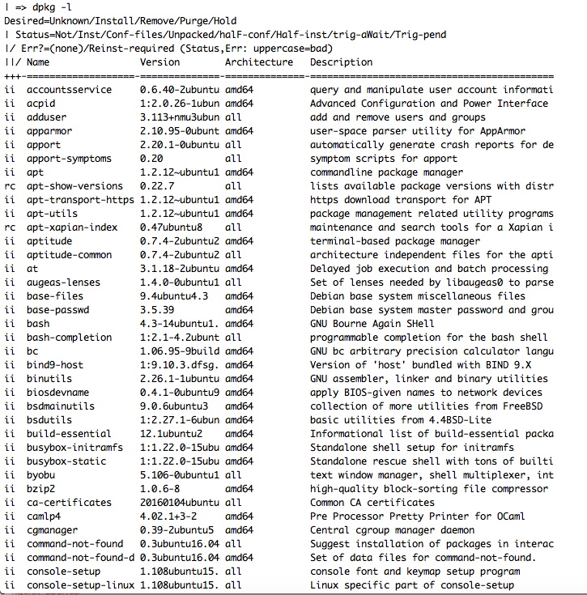

dpkg -l Package States
========================

This is specifically in reference to the flags at the start of each line when you perform ``dpkg -l``.

In the above image, far left, you can see the column that has ``ii`` or ``rc``. That would be the specific info I'm referencing, and knowing this info doesn't hurt!

Definitions
----------------

===========  ====================  ===============
1st Letter  2nd Letter  Opt. 3rd Letter
===========  ====================  ===============
u - unknown  n - not-installed   r reinst-required
i - install  i - installed
r - remove   c - config-files
p - purge    u - unpacked
h - hold     f - half-configured
             h - half-installed
             w - triggers-awaited
             t - triggers-pending
