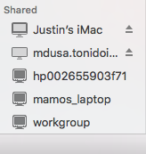
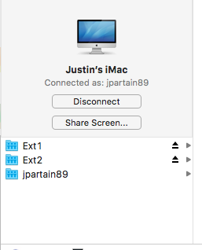

==================
Back to my mac SSH
==================

So, Apple provides a service they call "Back to my mac", that helps to facilitate making remote computing one of the easiest things in the world.

Finder Stuff
============

The first, big use for it would be the ability to access, say, your iMac Desktop's files while you aren't at home. If, of course, you have file sharing turned on. In your finder's left sidebar, you'll notice that your other mac's names appear there.

There, under "Shared", you can see "Justin's iMac". In here, you have a few more options, specifically dependent upon the settings you have currently setup on your system. From Screen Sharing to accessing your shared files.

These options are available, even when you are away from your home network.

SSH
====

You are also able to use the back to my mac service to help facilitate ssh access to your machines as well, without knowing your public IP address or even forwarding any ports on your router.

One command you can use to get various bits of info is ``dns-sd -E``. This gives you a, admittedly weird, layout of your back to my mac address.

.. code-block:: bash

  Looking for recommended registration domains:
  DATE: ---Wed 24 Aug 2016---
  22:28:28.704  ...STARTING...
  Timestamp     Recommended Registration domain
  22:28:28.706  Added     (More)               local
  22:28:28.706  Added                          icloud.com
                                            - > btmm
                                            - - > members
                                            - - - > 1307196220

The best one liner command to get a nice looking format of the same address is:

  ``echo show Setup:/Network/BackToMyMac | scutil | sed -n 's/.* : *\(.*\).$/\1/p'``

This gives you:

  ``1307196220.members.btmm.icloud.com``

Which, that number, is honestly not a bad thing to show to the world, because you also need your specific machine name, username and password or SSH keys to really do anything.

So, a full example address is:

  ``ssh jpartain89@imac.1307196220.members.btmm.icloud.com``
