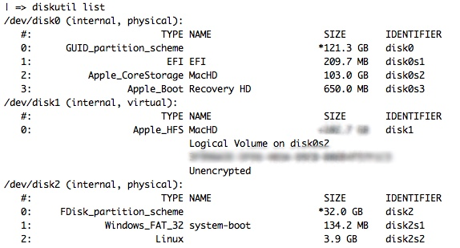

DDRescue
==========

This is my personal, favorite means of imaging an SD Card through the command line - which is the easiest, most foolproof means of doing so. Plus, its also learning, which is reason #1 for doing this....

A nice, command line output of its copying progress.... Not to mention ddrescue tends to be a more granular means of copying files over.

Plus, sans SD Card? Its a good backup tool to have for, well, backing up filesystems on a more granular, hardware-is-prone-to-fail type of level. Also allowing multiple passes over said data, so that if the sector pooped out the first time, maybe a 2nd or 3rd pass would, maybe not help but increase the odds of that one sector copying.

Its original intent, as you might can gather from its name, is to go over a potentially failing or failed hard drive, sector by sector, to try to pull ANY info whatsoever from that drive. Thus, the options for "retry passes," "max-errors" and the like.

Imaging SD Card for Raspberry Pi
----------------------------------------

Installing
___________

So, if you're using macOS? I would assume/hope you have 'HomeBrew <brew.sh>'_ installed. If so, do:

.. code-block:: bash

  brew install ddrescue

On Linux, the specific, newer and updated tool is called 'GDDRescue <https://www.gnu.org/software/ddrescue/ddrescue.html>'_, since its a part of the GNU Library of Tools.

So, to install on debian-based linux:

.. code-block:: bash

  sudo apt-get install gddrescue

How is it used?
__________________

First, do your OS of choices means of discovering the location of the SD card you want to image:

macOS/OS X

.. code-block:: bash

  diskutil list

Which gives you the list of all drives mounted or visible on OS X/macOS. Which, usually your SD Card is last.

Next, we want to unmount the drive - not eject - so we can write to the root of the SD card.

.. code-block:: bash

  diskutil umountDisk /dev/disk##

Replacing ## with the disk drive number you found from before.

.. code-block:: bash

  sudo ddrescue -f ~/.img/location/to/copy/to /dev/disk##

Lets break that last one down:

First, ``-f`` flag is for Force, telling ddrescue we REALLY want to image this source file onto this drive.

Second, the first file location. This is the source file, or what you want the SD card to look like. Or in the case of backing up a drive, the first location.

Then, the ``/dev/disk##``. Make sure to replace ``##`` with the drive number, again. This is the final place you want the info copied to. If you were doing the backup, like above, you could specify a specific file location, name and format to output the info into. Which is beyond this documents scope. ``man ddrescue``, or ``ddrescue --help`` can get you in the right direction.

Next, sit back and relax as you can watch the timer count down, the length of time passed count up, and plenty of other info while ``dd`` users have to sit and wait and HOPE it works.
