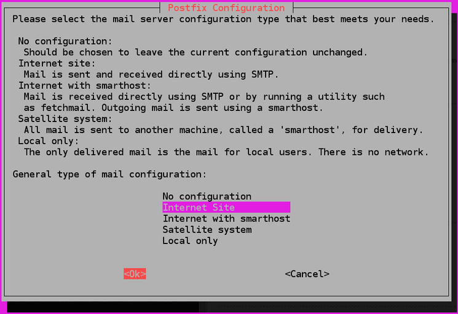

============================================
Using Postfix as Mail Relay [POSTFIX-HowTo]_
============================================

So, postfix is a fairly full-featured, backend mailserver software, that, to be honest, the reason I'm using it is because the most recent, up to date how-to's all use postfix. Which, I'm assuming that means its probably one of the easier mail systems to configure.

But, we will be using it to forward all of the system emails to our personal email address. I use gmail, so my examples will be more geared towards gmails smtp address and port.

Install Postfix
===============

.. code-block:: bash

  sudo apt-get install postfix mailutils

Now, during this installation, the system will prompt you with ``Configuration Option`` s. Since we will be using an outside service to send our mail - aka `smtp.gmail.com <smtp.gmail.com>`_ - we will select ``Internet Site``.

If we were to use postfix in other ways, we'd pick another option.

Then, it will continue on with ``System Mail Name``, which, technically you would normally want a FQDN address listed here. But, using your systems basic hostname is also fine, especially if you have just a couple of machines.

.. image:: pf_mailname.jpg
  :alt: PostFix Install Configuration Option 2
  :align: center

Configure Postfix
=================

We will be setting the system to process emails only from "the server on which it is running," aka the ``localhost`` or ``loopback interface``. That way, when postfix "receives" an email from the system - for say, root - it will use Postfix to forward the email off through our specified smtp server. Thus, using the loopback as the "catch-all" for the emails.

Password File
-------------------

First, we're going to make a seperate, locked down password file that Postfix will use to authenticate with gmail. ::

  sudo nano /etc/postfix/sasl_passwd

And add the line: ::

  [smtp.gmail.com]:587        username@gmail.com:password

Which, of course, if you use a different mail service, input their info and it should work just the same. And, also, ``username@gmail.com:password`` needs to be replaced with your info.

Now, lock that file down so only root can view it. ::

  sudo chmod 600 /etc/postfix/sasl_passwd
  sudo chown root:root /etc/postfix/sasl_passwd

Main Configure File
-------------------------

In the ``main.cf`` file, there are 6 specific parameters we will be using for the relay setup:

#. ``relayhost`` which specifies the mail relay host and port number. The host name will be enclosed in brackets to specify that no MX lookup is required.
#. ``smtp_use_tls`` which enables (or disables) transport layer security.
#. ``smtp_sasl_auth_enable`` which enables (or disables) SASL authentication.
#. ``smtp_sasl_security_options`` which in the following configuration will be set to empty, to ensure that no Gmail-incompatible security options are used.
#. ``smtp_sasl_password_maps`` which specifies the password file to use. This file will be compiled and hashed by postmap in a later step.
#. ``smtp_tls_CAfile`` which specifies the list of certificate authorities to use when verifying server identity.

.. code-block:: bash

  sudo nano /etc/postfix/main.cf

The ``main.cf`` is postfix's config file.

You will most likely have to add most of the above options, possibly deleting one or two in order to clump them all together in one, single block of text.

.. code-block:: bash

  relayhost = [smtp.gmail.com]:587
  smtp_use_tls = yes
  smtp_sasl_auth_enable = yes
  smtp_sasl_security_options =
  smtp_sasl_password_maps = hash:/etc/postfix/sasl_passwd
  smtp_tls_CAfile = /etc/ssl/certs/ca-certificates.crt

Process Password File
-----------------------------

Remember when you installed ``mailutils``? That was for ``postmap``, which compiles and hashes the contents of our ``sasl_passwd`` and creates a new file in the same spot, ``sasl_passwd.db``.

.. code-block:: bash

  sudo postmap /etc/postfix/sasl_passwd

Restart Postfix
===============

Restart postfix, enabling our various changes: ::

  sudo systemctl restart postfix.service

Send Test Emails
================

This is testing if the actual forwarding part works.

To send a test email over the command line: ::

  echo "This is the body of the email" | mail -s "This is the subject line" user@example.com

Making sure to put your email address in place of ``user@example.com``. You should receive the email within a few seconds.

.. [POSTFIX-HowTo] Copied very liberally from `HowToForge Postfix How-To <https://www.howtoforge.com/tutorial/configure-postfix-to-use-gmail-as-a-mail-relay/>`_
